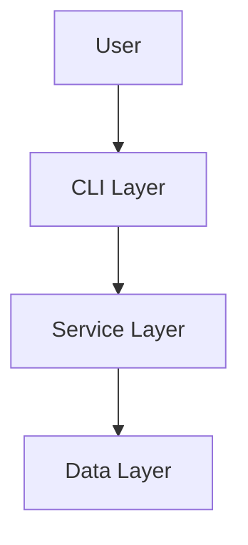
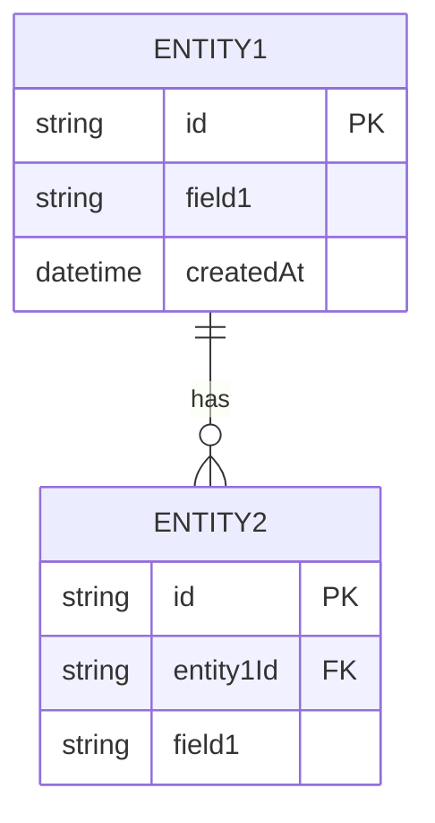
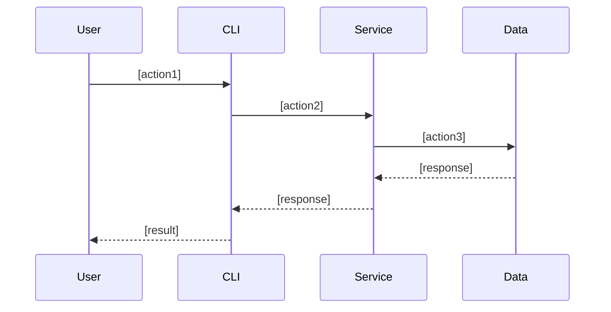
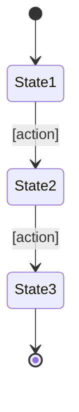

# Functional Design Document

## System Architecture Diagram



## Technology Stack

| Category | Technology | Selection Rationale |
|------|------|----------|
| Language | [Language name] | [Rationale] |
| Framework | [Name] | [Rationale] |
| Database | [Name] | [Rationale] |
| Tools | [Name] | [Rationale] |

## Data Model Definition

### Entity: [Entity Name]

```typescript
interface [EntityName] {
  id: string;              // UUID
  [field1]: [type];        // [description]
  [field2]: [type];        // [description]
  createdAt: Date;         // Creation timestamp
  updatedAt: Date;         // Update timestamp
}
```

**Constraints**:
- [Constraint 1]
- [Constraint 2]

### ER Diagram



## Component Design

### [Component 1]

**Responsibilities**:
- [Responsibility 1]
- [Responsibility 2]

**Interface**:
```typescript
class [ComponentName] {
  [method1]([params]): [return];
  [method2]([params]): [return];
}
```

**Dependencies**:
- [Dependency 1]
- [Dependency 2]

## Use Case Diagram

### [Use Case 1]



**Flow Description**:
1. [Step 1]
2. [Step 2]
3. [Step 3]

## Screen Transition Diagram (if applicable)



## API Design (if applicable)

### [Endpoint 1]

```
POST /api/[resource]
```

**Request**:
```json
{
  "[field]": "[value]"
}
```

**Response**:
```json
{
  "id": "uuid",
  "[field]": "[value]"
}
```

**Error Responses**:
- 400 Bad Request: [Condition]
- 404 Not Found: [Condition]
- 500 Internal Server Error: [Condition]

## Algorithm Design (if applicable)

### [Algorithm Name]

**Purpose**: [Description]

**Calculation Logic**:

#### Step 1: [Step Name]
- [Detailed description]
- Formula: `[formula]`
- Score range: 0-100 points

#### Step 2: [Step Name]
- [Detailed description]
- Formula: `[formula]`
- Score range: 0-100 points

#### Step 3: Total Score Calculation
- Weighted average: `Total Score = (Step 1 × Weight 1) + (Step 2 × Weight 2)`
- Weight allocation:
  - Step 1: [%]
  - Step 2: [%]

#### Step 4: Classification
- [Classification 1]: Score >= [threshold]
- [Classification 2]: [threshold] <= Score < [threshold]
- [Classification 3]: Score < [threshold]

**Implementation Example**:
```typescript
function [algorithmName]([params]): [return] {
  // Step 1
  const score1 = [calculation];

  // Step 2
  const score2 = [calculation];

  // Total score
  const totalScore = (score1 * weight1) + (score2 * weight2);

  // Classification
  if (totalScore >= threshold1) return '[classification1]';
  if (totalScore >= threshold2) return '[classification2]';
  return '[classification3]';
}
```

## UI Design (if applicable)

### Table Display

**Display Items**:
| Item | Description | Format |
|------|------|-------------|
| [Item 1] | [Description] | [Format] |
| [Item 2] | [Description] | [Format] |

### Color Coding

**Color Usage**:
- [Color 1]: [Use] (e.g., green = completed)
- [Color 2]: [Use] (e.g., yellow = in progress)
- [Color 3]: [Use] (e.g., red = not started)

### Interactive Mode (if applicable)

**Operation Flow**:
1. [Operation 1]
2. [Operation 2]
3. [Operation 3]

## File Structure (if applicable)

**Data Storage Format**:
```
[directory]/
├── [file1].json    # [description]
└── [file2].json    # [description]
```

**File Content Example**:
```json
{
  "[field]": "[value]"
}
```

## Performance Optimization

- [Optimization 1]: [Description]
- [Optimization 2]: [Description]

## Security Considerations

- [Consideration 1]: [Countermeasure]
- [Consideration 2]: [Countermeasure]

## Error Handling

### Error Classification

| Error Category | Handling | Display to User |
|-----------|------|-----------------|
| [Category 1] | [Handling details] | [Message] |
| [Category 2] | [Handling details] | [Message] |

## Testing Strategy

### Unit Tests
- [Target 1]
- [Target 2]

### Integration Tests
- [Scenario 1]
- [Scenario 2]

### E2E Tests
- [Scenario 1]
- [Scenario 2]
