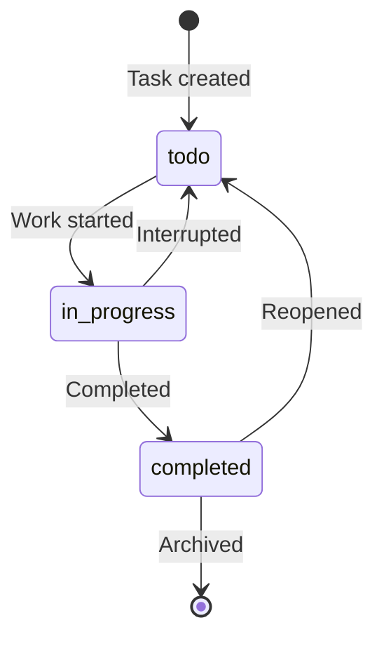

# Glossary Creation Guide

## Basic principles

### 1. Clear and consistent definitions

Term definitions should eliminate ambiguity so that everyone who reads them arrives at the same understanding.

**Bad example**:
```markdown
## Task
What the user should do
```

**Good example**:
```markdown
## Task (Task)
**Definition**: A unit of work that the user must complete. It has a title, description, due date,
and status (not started / in progress / completed).

**Related terms**: Subtask, Task group

**Usage examples**:
- "Add a task": Register a new task in the system
- "Complete a task": Change the task's status to completed

**Data model**: `src/types/Task.ts`
```

### 2. Include concrete examples

Show concrete usage examples, not just abstract definitions.

**Example**:
```markdown
## Priority (Priority)
**Definition**: A three-level indicator showing a task's importance and urgency

**Value definitions**:
- `high`: Urgent and important. Requires immediate response
- `medium`: Important but not urgent. Handle in a planned manner
- `low`: Low in both importance and urgency. Handle if there is time

**Decision criteria**:
- high: Due within 24 hours, or blocking other tasks
- medium: Due within one week
- low: Due more than one week out, or no due date

**Usage example**:
```typescript
const task: Task = {
  title: 'Fix security vulnerability',
  priority: 'high', // Requires urgent response
};
```
```

### 3. Link related terms

Make the relationships between terms clear.

**Example**:
```markdown
## Task (Task)
**Definition**: [Definition]

**Related terms**:
- [Subtask](#subtask): A task broken down into smaller parts
- [Task group](#task-group): Multiple tasks grouped together
- [Status](#task-status): The progress state of a task

**Parent-child relationship**:
- Parent: Task group
- Child: Subtask
```

## How to classify terms

### Defining domain terms

**Target**: Project-specific business concepts

**Items to define**:
```markdown
## [Term]

**Definition**: [A concise definition in 1-2 sentences]

**Description**: [Detailed explanation, background, constraints]

**Related terms**: [Other related terms]

**Usage examples**: [Specific usage scenarios]

**Data model**: [The relevant file path]

**English notation**: [English term] (when there is global expansion)
```

**Example**:
```markdown
## Steering File (Steering File)

**Definition**: A temporary document created for short-term task management

**Description**:
A steering file is placed in the `.steering/[YYYYMMDD]-[task-name]/` directory
and is deleted 1-2 weeks after the task is completed. It contains the task specification,
implementation notes, review records, and so on.

**Related terms**:
- [Persistent document](#persistent-document): A document stored for the long term
- [Task mode](#task-mode): The development mode that uses steering files

**Usage examples**:
- "Create a steering file for adding a feature"
- "After the task is completed, delete or archive the steering file"

**Directory structure**:
```
.steering/
└── 20250101-add-priority-feature/
    ├── requirements.md      # The requirements for this task
    ├── design.md            # The design of the changes
    └── tasklist.md          # The task list
```

**English notation**: Steering File
```

### Defining technical terms

**Target**: The technologies, frameworks, and tools in use

**Items to define**:
```markdown
## [Technology name]

**Definition**: [A concise description of the technology]

**Official site**: [URL]

**Use in this project**: [How it is used]

**Version**: [Version in use]

**Reason for selection**: [Why this technology was chosen]

**Alternative technologies**: [Other options that were considered]

**Related documents**: [Links to internal documents]

**Configuration file**: [Path to the configuration file]
```

**Example**:
```markdown
## TypeScript

**Definition**: A programming language that adds static typing to JavaScript

**Official site**: https://www.typescriptlang.org/

**Use in this project**:
All source code is written in TypeScript to ensure type safety.

**Version**: 5.3.x

**Reason for selection**:
- Improved maintainability in large-scale development
- Improved development efficiency through editor completion
- Error detection at compile time

**Alternative technologies**:
- JavaScript ESM: Cannot benefit from type checking
- Flow: Inferior to TypeScript in ecosystem maturity

**Related documents**:
- [Architecture Design Document](./architecture.md#technology-stack)
- [Development Guidelines](./development-guidelines.md#typescript-conventions)

**Configuration file**: `tsconfig.json`
```

### Defining abbreviations and acronyms

**Principles**:
- State the full name clearly
- On first appearance, write both the abbreviation and the full name
- Avoid project-specific abbreviations (use only common abbreviations)

**Example**:
```markdown
## CLI

**Full name**: Command Line Interface

**Meaning**: An interface operated from the command line

**Use in this project**:
Used as the main interface of the Devtask tool. Users operate tasks with commands like
`devtask add "task"`.

**Implementation**: `src/cli/` directory

**Alternative interface**: A GUI version is under consideration as a future extension

## TDD

**Full name**: Test-Driven Development

**Meaning**: A development method in which tests are written first and then the implementation follows

**Application in this project**:
TDD is adopted for all new feature development.

**Procedure**:
1. Write a test
2. Run the test → confirm it fails
3. Write the implementation
4. Run the test → confirm it succeeds
5. Refactor

**Reference**: [Development Guidelines](./development-guidelines.md#tdd)
```

### Defining architecture terms

**Target**: Concepts related to system design and patterns

**Items to define**:
```markdown
## [Concept]

**Definition**: [Explanation of the architecture concept]

**Application in this project**: [The specific implementation method]

**Advantages**: [Reasons for adoption]

**Disadvantages**: [Constraints and trade-offs]

**Related components**: [Related components]

**Diagram**: [Structure diagram]

**References**: [References or URLs]
```

**Example**:
```markdown
## Layered Architecture (Layered Architecture)

**Definition**: A design pattern that divides a system into multiple layers by role,
with a one-directional dependency from upper layers to lower layers

**Application in this project**:
A three-layer architecture is adopted:

```
UI layer (cli/)
    ↓
Service layer (services/)
    ↓
Data layer (repositories/)
```

**Responsibilities of each layer**:
- UI layer: Accepting and displaying user input
- Service layer: Implementing business logic
- Data layer: Persisting and retrieving data

**Advantages**:
- Improved maintainability through separation of concerns
- Easy to test (each layer can be tested independently)
- A limited scope of impact from changes

**Disadvantages**:
- May be over-engineering for small-scale projects
- Overhead in data conversion between layers

**Dependency rules**:
- ✅ UI layer → Service layer
- ✅ Service layer → Data layer
- ❌ Data layer → Service layer
- ❌ Data layer → UI layer

**Implementation location**: Reflected in the structure of the `src/` directory

**References**:
- [Architecture Design Document](./architecture.md)
- [Repository Structure Definition Document](./repository-structure.md)
```

## Defining state transitions

**Target**: The statuses or states of an entity

**Definition method**:

1. **Enumerate in table form**
2. **State the transition conditions clearly**
3. **Visualize with a Mermaid diagram**

**Example**:
```markdown
## Task Status (Task Status)

**Definition**: An enumerated type that indicates the progress state of a task

**Possible values**:

| Status | Meaning | Transition condition | Next state |
|----------|------|---------|---------|
| `todo` | Not started | Initial state when the task is created | `in_progress` |
| `in_progress` | In progress | The user starts the task | `completed`, `todo` |
| `completed` | Completed | The user completes the task | `todo` (can be reopened) |

**State transition diagram**:


**Implementation**:
```typescript
// src/types/Task.ts
export type TaskStatus = 'todo' | 'in_progress' | 'completed';

// Validation of state transitions
function canTransition(
  from: TaskStatus,
  to: TaskStatus
): boolean {
  const validTransitions: Record<TaskStatus, TaskStatus[]> = {
    todo: ['in_progress'],
    in_progress: ['completed', 'todo'],
    completed: ['todo'],
  };
  return validTransitions[from].includes(to);
}
```

**Business rules**:
- Direct transition from `todo` → `completed` is prohibited
- A completed task can be reopened
- An archived task cannot be changed
```

## Defining errors and exceptions

**Target**: The error classes defined in the system

**Items to define**:
```markdown
## [Error name]

**Class name**: `[ErrorClassName]`

**Inherits from**: `Error` or `[ParentError]`

**Conditions for occurrence**: [When it occurs]

**Error message format**: [The format of the message]

**How to handle**:
- User: [What the user should do]
- Developer: [What the developer should do]

**Error code**: [If applicable]

**Log level**: [ERROR, WARN, INFO]

**Implementation location**: [File path]

**Usage example**: [Code example]
```

**Example**:
```markdown
## Validation Error (Validation Error)

**Class name**: `ValidationError`

**Inherits from**: `Error`

**Conditions for occurrence**:
Occurs when user input violates a business rule.

**Error message format**:
```
[Field name]: [Error description]
```

**How to handle**:
- User: Correct the input according to the error message
- Developer: Confirm whether the validation logic is correct

**Error code**: `VAL-XXX` (XXX is a 3-digit number)

**Log level**: WARN (because it is a user-caused error)

**Implementation location**: `src/errors/ValidationError.ts`

**Usage example**:
```typescript
// Throwing the error
if (title.length === 0) {
  throw new ValidationError(
    'Title is required',
    'title',
    title
  );
}

// Handling the error
try {
  await taskService.create(data);
} catch (error) {
  if (error instanceof ValidationError) {
    console.error(`Input error: ${error.message}`);
    console.error(`Field: ${error.field}`);
  }
}
```

**Related validations**:
- Title: 1-200 characters
- Due date: Now or later
- Priority: One of high, medium, low
```

## Maintaining and updating terms

### When to add a term

**When you should add**:
- A new concept has been introduced
- A term that team members have asked about
- A term that appears three or more times in the documentation
- When an external service or API has been integrated

**When you do not need to add**:
- General programming terms (variables, functions, etc.)
- Temporary terms used only once

### Update workflow

1. **Add or change a term**
   - Add it to the appropriate category
   - Fill in all definition items
   - Link related terms

2. **Review**
   - Share with team members
   - Confirm the validity of the definition

3. **Record the change history**
   - Update the change history table of the glossary
   - Note it in the commit message

4. **Confirm the scope of impact**
   - Search for places where the term is used
   - Update documents as needed

### Managing the index

**Organize in Japanese syllabary order / alphabetical order**:

```markdown
## Index

### A-row
- [Archive](#archive) - Process term
- [Error handling](#error-handling) - Technical term

### KA-row
- [Coverage](#coverage) - Technical term

### SA-row
- [Steering file](#steering-file) - Domain term
- [Status](#task-status) - Data model term

### TA-row
- [Task](#task) - Domain term
- [TDD](#tdd) - Abbreviation

### A-Z
- [CLI](#cli) - Abbreviation
- [TypeScript](#typescript) - Technical term
```

## Checklist

- [ ] Every term is clearly defined
- [ ] Concrete examples are included
- [ ] Related terms are linked
- [ ] Categories are appropriately classified
- [ ] Technical terms include version information
- [ ] Abbreviations include their full names
- [ ] State transitions are illustrated with diagrams
- [ ] Errors include how to handle them
- [ ] The index is organized
- [ ] The change history is recorded
