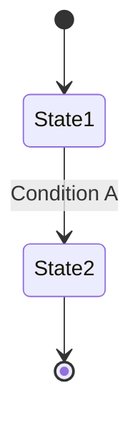

# Project Glossary

## Overview

This document manages the definitions of terms used within the project.

**Updated**: [YYYY-MM-DD]

## Domain Terms

Terms related to project-specific business concepts and features.

### [Term 1]

**Definition**: [Clear definition]

**Description**: [Detailed description]

**Related Terms**: [Other related terms]

**Usage Examples**:
- [Example 1]
- [Example 2]

**English Notation**: [English Term]

### [Term 2]

**Definition**: [Clear definition]

**Description**: [Detailed description]

**Related Terms**: [Other related terms]

**Usage Examples**:
- [Example 1]
- [Example 2]

## Technical Terms

Terms related to the technologies, frameworks, and tools used in the project.

### [Technology 1]

**Definition**: [Description of the technology]

**Official Site**: [URL]

**Usage in This Project**: [How it is used]

**Version**: [Version used]

**Related Documents**: [Links to internal documents]

### [Technology 2]

**Definition**: [Description of the technology]

**Official Site**: [URL]

**Usage in This Project**: [How it is used]

**Version**: [Version used]

## Abbreviations and Acronyms

### [Abbreviation 1]

**Full Name**: [Full Name]

**Meaning**: [Description]

**Usage in This Project**: [Where it is used]

### [Abbreviation 2]

**Full Name**: [Full Name]

**Meaning**: [Description]

**Usage in This Project**: [Where it is used]

## Architecture Terms

Terms related to system design and architecture.

### [Concept 1]

**Definition**: [Description of the architecture concept]

**Application in This Project**: [How it is implemented]

**Related Components**: [Related component names]

**Diagram**:
```
[ASCII diagram or Mermaid diagram]
```

### [Concept 2]

**Definition**: [Description of the architecture concept]

**Application in This Project**: [How it is implemented]

## Statuses and States

Definitions of various statuses used within the system.

### [Status Category 1]

| Status | Meaning | Transition Condition | Next State |
|----------|------|---------|---------|
| [State 1] | [Description] | [Condition] | [Next State] |
| [State 2] | [Description] | [Condition] | [Next State] |

**State Transition Diagram**:


## Data Model Terms

Terms related to databases and data structures.

### [Entity 1]

**Definition**: [Description of the entity]

**Key Fields**:
- `field1`: [Description]
- `field2`: [Description]

**Related Entities**: [Related entities]

**Constraints**: [Unique constraints, foreign key constraints, etc.]

## Errors and Exceptions

Errors and exceptions defined in the system.

### [Error Category 1]

**Class Name**: `[ErrorClassName]`

**Trigger Condition**: [When it occurs]

**Resolution**: [How users/developers should handle it]

**Error Code**: [If applicable]

**Example**:
```typescript
throw new [ErrorClassName]('[message]');
```

## Calculations and Algorithms (if applicable)

Terms related to specific calculation methods or algorithms.

### [Calculation Method 1]

**Definition**: [Description of the calculation method]

**Formula**:
```
[Formula]
```

**Implementation Location**: `src/[path]/[file].ts`

**Example**:
```
Input: [Example]
Output: [Result]
```
