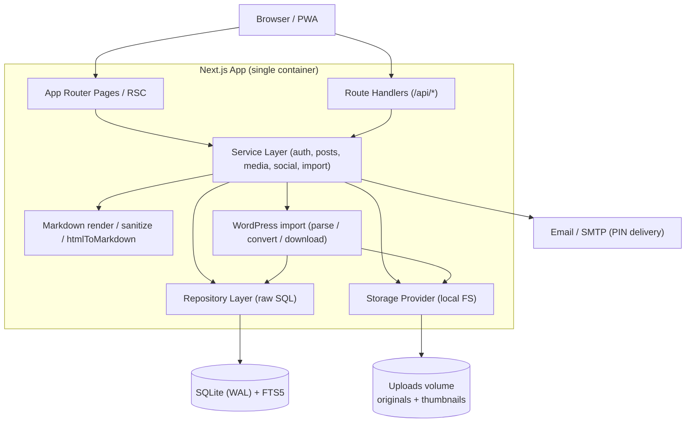
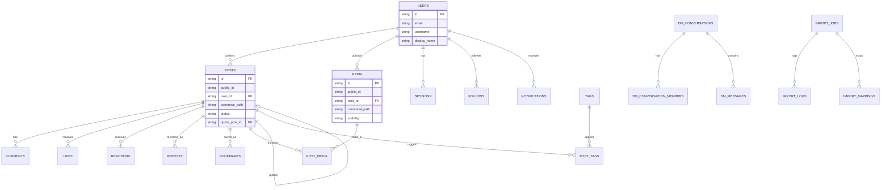
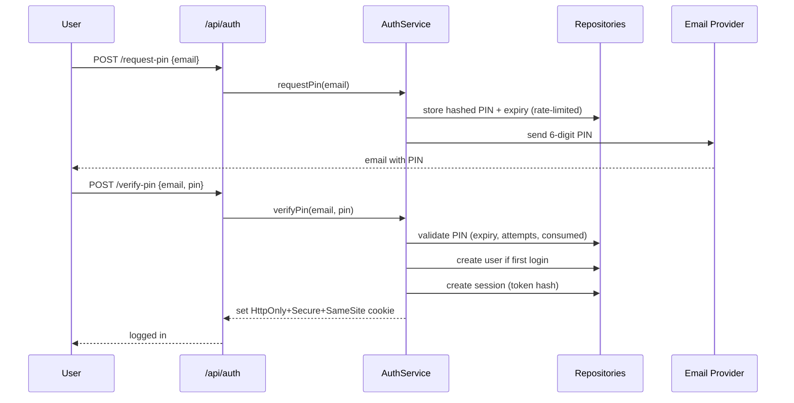
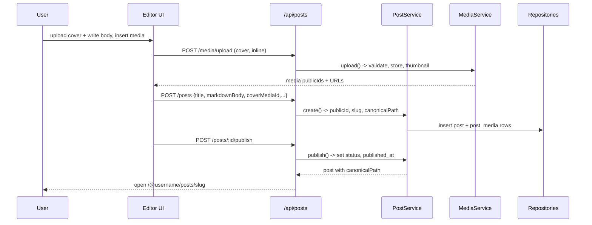
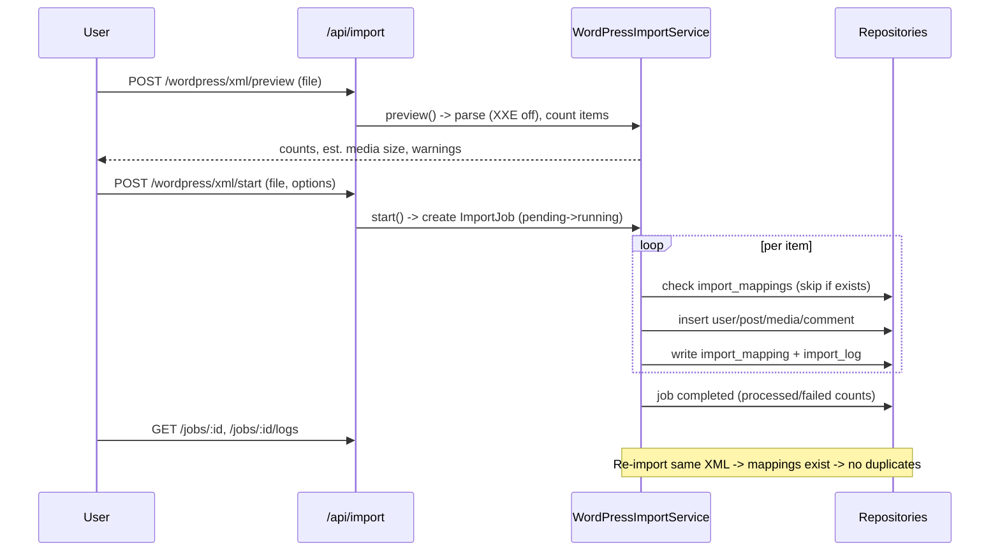

# Functional Design Document

This document describes how AstroSocial technically realizes the requirements in `docs/product-requirements.md`. It focuses on the system shape, data model, components, key flows, API contract, and cross-cutting concerns. Repository layout and coding conventions live in `docs/repository-structure.md` and `docs/development-guidelines.md`; deeper architectural rationale lives in `docs/architecture.md`.

## System Architecture Diagram



AstroSocial is a single Next.js application running in one container. There is no separate backend service: server-side logic lives in the service layer, called from both App Router server components and `/api` route handlers. Persistence is SQLite (via `better-sqlite3`) accessed exclusively through repository classes that run parameterized raw SQL. Uploaded files live on a mounted volume. Email (PIN delivery) goes through an SMTP/email provider abstraction (a mock server is used in E2E).

## Technology Stack

| Category | Technology | Selection Rationale |
|------|------|----------|
| Language | TypeScript 5.x | Type safety across server and client; matches project standard. |
| Runtime | Node.js v24.11.0 | Project-pinned runtime; required by `better-sqlite3`. |
| Framework | Next.js (App Router) | Unified server + client, RSC for fast list/feed rendering, built-in route handlers, PWA-friendly. |
| Database | SQLite | Zero-ops, single-file, perfect for self-hosting; FTS5 provides full-text search without extra services. |
| DB driver | better-sqlite3 | Synchronous, simple, fast, easy to test; good fit for self-hosted single-node apps. |
| SQL access | Raw SQL + repository classes | No ORM policy; explicit, auditable, parameterized queries. |
| Editor | Tiptap (with Markdown conversion) or Milkdown | Supports both WYSIWYG and Markdown; extensible toolbar and media insertion. |
| Media | Node FS + sharp (images), optional ffmpeg (video thumbnails) | Local storage with safe re-encoding/thumbnailing; ffmpeg optional for posters. |
| Sanitization | HTML sanitizer + Markdown renderer | XSS protection for user Markdown and imported WordPress HTML. |
| Testing | Unit framework (Vitest/Jest) + Playwright | Unit coverage of core logic; Playwright E2E for major flows in Docker. |
| Packaging | Docker Compose | One-command self-host with persistent volumes. |
| PWA | manifest + service worker | Installable, offline fallback, static asset caching. |

## Data Model Definition

The authoritative schema is the SQL in `docs/architecture.md` / the `migrations/` directory. The TypeScript interfaces below are the in-app representations returned by repositories (timestamps are ISO-8601 `TEXT` in SQLite, surfaced as `string`).

### Entity: User

```typescript
interface User {
  id: string;              // primary key (app-generated id)
  email: string;           // unique
  username: string;        // unique, used in URLs (@username)
  displayName: string;
  bio: string | null;
  avatarMediaId: string | null;
  coverMediaId: string | null;
  websiteUrl: string | null;
  location: string | null;
  dmPolicy: 'everyone' | 'following' | 'mutual' | 'nobody'; // default 'everyone'
  createdAt: string;
  updatedAt: string;
}
```

**Constraints**:
- `email` and `username` are unique.
- `username` must be URL-safe (used in canonical paths).

### Entity: Post

```typescript
interface Post {
  id: string;
  publicId: string;        // unique, e.g. p_8f3a9c21
  userId: string;
  title: string | null;
  slug: string | null;     // unique per user
  canonicalPath: string;   // unique, e.g. /@ken/posts/openmeow-design
  markdownBody: string;
  excerpt: string | null;
  coverMediaId: string | null;
  quotePostId: string | null; // set for quote posts
  status: 'draft' | 'published' | 'archived';
  publishedAt: string | null;
  createdAt: string;
  updatedAt: string;
}
```

**Constraints**:
- `public_id`, `canonical_path` unique; `(user_id, slug)` unique.
- A quote post is a normal post with `quotePostId` set; if the referenced post is deleted, the quote remains and renders a "deleted" placeholder.

### Entity: Media

```typescript
interface Media {
  id: string;
  publicId: string;        // unique, e.g. m_7a2c91df
  userId: string;
  canonicalPath: string;   // unique, e.g. /@ken/media/m_7a2c91df
  fileName: string;        // randomized stored name
  originalFileName: string | null;
  mimeType: string;
  fileSize: number;
  width: number | null;
  height: number | null;
  durationSeconds: number | null;
  storagePath: string;
  thumbnailPath: string | null;
  altText: string | null;
  caption: string | null;
  visibility: 'public' | 'unlisted' | 'private'; // default 'public'
  createdAt: string;
}
```

**Constraints**:
- `public_id`, `canonical_path` unique.
- Stored file name is randomized; original name kept only as metadata.

### Other entities

Social and system tables follow the same pattern (full SQL in `docs/architecture.md`):
`LoginPin`, `Session`, `PostMedia` (usage_type: cover/attachment/inline), `Comment` (with guest_* fields for imported WordPress comments), `Like`, `Reaction` (unique per post+user+emoji), `Follow`, `Repost`, `Bookmark`, `Notification`, `DmConversation`, `DmConversationMember`, `DmMessage`, `Tag` (type: tag/category), `PostTag`, `TrendSnapshot`, `ImportJob`, `ImportLog`, `ImportMapping`, and `migrations`.

### ER Diagram



## Component Design

### AuthService

**Responsibilities**:
- Issue and verify email PINs; create users on first login; create/destroy sessions.
- Enforce PIN expiry, resend rate limits, and failed-attempt caps.

**Interface**:
```typescript
class AuthService {
  requestPin(email: string): Promise<void>;                 // generate, hash, store, send PIN
  verifyPin(email: string, pin: string): Promise<Session>;  // validate, create-or-find user, open session
  logout(sessionToken: string): Promise<void>;
  getCurrentUser(sessionToken: string): Promise<User | null>;
}
```

**Dependencies**: `LoginPinRepository`, `SessionRepository`, `UserRepository`, email provider, hashing util, rate limiter.

**Email delivery**: the email provider is an abstraction (`EmailProvider`). `ConsoleEmailProvider`
logs the PIN (dev/test); `SmtpEmailProvider` sends it over SMTP (nodemailer) using the
admin-configured settings, falling back to console logging when SMTP is unconfigured. In test
mode the PIN is fixed (`000000`) and email is not sent.

### AdminService (admin console)

**Responsibilities**:
- Authenticate the single admin account against the environment constants
  (`ADMIN_USERNAME`/`ADMIN_PASSWORD`) with a constant-time compare; mint/validate/expire an
  in-memory admin session (separate `as_admin` HttpOnly cookie).
- Moderation: list/edit/delete users (transactional cascade via `AdminRepository`), posts
  (`PostRepository.deleteWithDependents`), and comments (soft delete). The user edit form
  also updates the **email address** (identity, not a profile field): on save it is
  normalized (trim + lower-case) and validated for format and uniqueness, with an inline
  error (400) on failure; the DB `UNIQUE` index is the backstop for a concurrent collision.
- Read/save settings (via `SettingsService` over the `app_settings` key/value table):
  SMTP delivery; **site name + description**; and a **login-email template** supporting the
  tags `{PIN}` and `{sitename}`. `SettingsService.renderLoginEmail(pin)` substitutes the tags
  (defaults applied when blank) for both SMTP sends and the console fallback. The login page
  shows the configured site name + description, and the social app shell uses the site name
  for the nav-rail brand, the window `<title>`, and `og:site_name` (via `ShellContext.siteName`,
  falling back to `AstroSocial`).

Admin pages are server-rendered HTML under `/admin/*` (login, dashboard, users, posts,
comments, settings); every route except login requires a valid admin session. Mutations are
POST→redirect→GET; the admin cookie is HttpOnly + SameSite=Lax (CSRF mitigation).

### PostService

**Responsibilities**:
- Create/update/publish/archive/delete posts; generate `publicId`, `slug`, and `canonicalPath`; repost and quote logic; render Markdown for display.

**Interface**:
```typescript
class PostService {
  create(userId: string, input: CreatePostInput): Promise<Post>;
  update(userId: string, postId: string, input: UpdatePostInput): Promise<Post>;
  publish(userId: string, postId: string): Promise<Post>;
  archive(userId: string, postId: string): Promise<Post>;
  delete(userId: string, postId: string): Promise<void>;
  repost(userId: string, postId: string): Promise<void>;
  quote(userId: string, postId: string, input: CreatePostInput): Promise<Post>;
  getByCanonicalPath(path: string): Promise<PostView | null>;
}
```

**Dependencies**: `PostRepository`, `RepostRepository`, `MediaRepository`, URL utils (`publicId`, `slug`, `canonicalPath`), Markdown render/sanitize, `NotificationService`.

### MediaService

**Responsibilities**:
- Validate, store, and re-encode uploads; generate thumbnails; build media public URLs; track media usage in posts.

**Interface**:
```typescript
class MediaService {
  upload(userId: string, file: UploadedFile): Promise<Media>;
  getPublic(publicId: string, variant: 'original' | 'thumbnail'): Promise<MediaFile | null>;
  delete(userId: string, mediaId: string): Promise<void>;
}
```

**Dependencies**: `MediaRepository`, `PostMediaRepository`, storage provider, image processor (sharp), optional ffmpeg, validation utils.

### SocialService(s)

**Responsibilities**: Comments, likes, reactions, follows, bookmarks, and timeline assembly. Each emits notifications.

**Interface**:
```typescript
class SocialService {
  comment(userId: string, postId: string, body: string): Promise<Comment>;
  like(userId: string, postId: string): Promise<void>;
  react(userId: string, postId: string, emoji: string): Promise<void>;
  follow(userId: string, targetUserId: string): Promise<void>;
  bookmark(userId: string, postId: string): Promise<void>;
  followingTimeline(userId: string, cursor?: string): Promise<TimelineItem[]>;
}
```

**Dependencies**: respective repositories + `NotificationRepository`.

### WordPressImportService

**Responsibilities**:
- Parse Export XML safely (XXE disabled), build a preview, run an import job, convert HTML→Markdown, download and replace inline media, map statuses, write logs, and prevent duplicates via `import_mappings`.

**Interface**:
```typescript
class WordPressImportService {
  preview(xml: Buffer): Promise<ImportPreview>;
  start(userId: string, xml: Buffer, options: ImportOptions): Promise<ImportJob>;
  getJob(jobId: string): Promise<ImportJob>;
  getLogs(jobId: string): Promise<ImportLog[]>;
  cancel(jobId: string): Promise<void>;
  retry(jobId: string): Promise<void>;
}
```

**Dependencies**: `parseXml`, `convertPost` (htmlToMarkdown + shortcode/Gutenberg handling), `importMedia` (safe downloader), repositories, `ImportRepository`, sanitizer.

### MigrationRunner

**Responsibilities**: On startup, read `migrations/*.sql` in filename order, apply pending ones in a transaction, record them in the `migrations` table, and fail startup on error.

## Use Case Diagrams

### Passwordless login (request + verify PIN)



### Create and publish a post with cover image



### WordPress XML import (preview → run → idempotent re-import)



## Screen Transition Diagram

```mermaid
stateDiagram-v2
    [*] --> Home
    Home --> Login: not authenticated action
    Login --> PinVerify: submit email
    PinVerify --> Home: PIN ok (session)
    Home --> PostDetail: open post card
    Home --> Profile: open author
    Home --> CreatePost: new post (auth)
    CreatePost --> Drafts: save draft
    CreatePost --> PostDetail: publish
    Home --> Search
    Home --> Trends
    Home --> Notifications: (auth)
    Home --> DMInbox: (auth)
    DMInbox --> DMConversation
    Profile --> ProfileSettings: (own profile)
    Home --> WordPressImport: (auth)
    WordPressImport --> ImportPreview --> ImportProgress --> ImportComplete
```

## API Design

All endpoints are JSON over HTTP under `/api`, except direct media file serving. Auth is via the session cookie. Standard error envelope:

```json
{ "error": { "code": "string", "message": "string" } }
```

Common error responses apply to all endpoints: `400` (validation), `401` (not authenticated), `403` (not owner/insufficient permission), `404` (not found), `429` (rate limited), `500` (server error).

### Auth

```
POST /api/auth/request-pin    body: { email }                 -> 204
POST /api/auth/verify-pin     body: { email, pin }            -> 200 { user } + Set-Cookie
POST /api/auth/logout                                          -> 204
GET  /api/auth/me                                              -> 200 { user } | 401
```

### Posts

```
GET    /api/posts?cursor=&limit=        -> 200 { items: PostCard[], nextCursor }
GET    /api/feed?tab=foryou&cursor=     -> 200 { html, nextCursor }   # rendered card HTML for infinite scroll
GET    /api/users/:username/posts?cursor= -> 200 { html, nextCursor } # a user's published posts (profile infinite scroll)
POST   /api/posts                        body: CreatePostInput   -> 201 { post }
GET    /api/posts/:id                                            -> 200 { post }
PUT    /api/posts/:id                     body: UpdatePostInput  -> 200 { post }
DELETE /api/posts/:id                                            -> 204
POST   /api/posts/:id/publish                                    -> 200 { post }
POST   /api/posts/:id/archive                                    -> 200 { post }
POST   /api/posts/:id/repost                                     -> 204
DELETE /api/posts/:id/repost                                     -> 204
POST   /api/posts/:id/quote               body: CreatePostInput  -> 201 { post }
GET    /api/posts/:id/quotes                                     -> 200 { items }
```

**Example — create post**

Request:
```json
{
  "title": "AstroSocial Design Notes",
  "markdownBody": "# Hello\n\nFirst post...",
  "coverMediaId": "m_7a2c91df",
  "status": "draft"
}
```
Response:
```json
{
  "post": {
    "id": "...",
    "publicId": "p_8f3a9c21",
    "slug": "openmeow-design-notes",
    "canonicalPath": "/@ken/posts/openmeow-design-notes",
    "status": "draft"
  }
}
```

### Media

```
POST   /api/media/upload     multipart file(s)   -> 201 { media: Media[] }
GET    /api/media?cursor=                          -> 200 { items, nextCursor }
GET    /api/media/:id                              -> 200 { media }
DELETE /api/media/:id                              -> 204
GET    /media/:publicId/original                   -> binary (respects visibility)
GET    /media/:publicId/thumbnail                  -> binary
```

### Comments, reactions, follows

```
GET    /api/posts/:id/comments        POST /api/posts/:id/comments
PUT    /api/comments/:id              DELETE /api/comments/:id
POST   /api/posts/:id/like           DELETE /api/posts/:id/like
POST   /api/posts/:id/reactions       body { emoji }   DELETE /api/posts/:id/reactions  body { emoji }
POST   /api/users/:id/follow         DELETE /api/users/:id/follow
GET    /api/users/:id/followers       GET /api/users/:id/following
```

### DM, trends, import

```
GET    /api/dm/conversations          POST /api/dm/conversations
GET    /api/dm/conversations/:id       POST /api/dm/conversations/:id/messages
POST   /api/dm/conversations/:id/read  DELETE /api/dm/messages/:id
GET    /api/trends/posts | /tags | /users
POST   /api/import/wordpress/xml/preview   POST /api/import/wordpress/xml/start
GET    /api/import/jobs/:id             GET /api/import/jobs/:id/logs
POST   /api/import/jobs/:id/cancel      POST /api/import/jobs/:id/retry
```

## Algorithm Design

### Slug generation

**Purpose**: Produce a unique, URL-safe slug per user from a post title.

**Logic**:
1. Lowercase the title; replace non-alphanumeric runs with single hyphens; trim hyphens; truncate to 80 chars.
2. If empty (no title), use the `publicId` form (e.g. `p_8f3a9c21`).
3. If `(user_id, slug)` collides, append `-2`, `-3`, …; if still colliding, append a short public-id fragment (e.g. `-p8f3`).

```typescript
function generateSlug(title: string | null, publicId: string, exists: (s: string) => boolean): string {
  let base = (title ?? '').toLowerCase().replace(/[^a-z0-9]+/g, '-').replace(/^-+|-+$/g, '').slice(0, 80);
  if (!base) return publicId;
  if (!exists(base)) return base;
  for (let n = 2; n <= 50; n++) { const c = `${base}-${n}`; if (!exists(c)) return c; }
  return `${base}-${publicId.split('_')[1]?.slice(0, 4) ?? ''}`;
}
```

### Trend score

**Purpose**: Rank posts/tags/users by engagement within a time window.

**Calculation Logic**:

#### Step 1: Weighted engagement sum
- Formula: `score = likes×1 + reactions×1 + comments×2 + reposts×3 + quotes×3 + bookmarks×2`

#### Step 2: Age decay (optional)
- Recent activity weighted higher; older snapshots decayed by a configurable factor.

#### Step 3: Ranking
- Compute per period (24h / 7d / 30d), sort descending, assign `rank`, and persist into `trend_snapshots` on a periodic schedule (not fully real-time).

**Implementation Example**:
```typescript
function trendScore(c: Counts): number {
  return c.likes*1 + c.reactions*1 + c.comments*2 + c.reposts*3 + c.quotes*3 + c.bookmarks*2;
}
```

## UI Design

### Post card (home grid)

**Display Items**:
| Item | Description | Format |
|------|------|-------------|
| Cover image | Thumbnail variant | Responsive image, lazy-loaded |
| Title | Post title | Truncated to ~2 lines |
| Author | Display name + avatar | Inline |
| Published date | Relative or absolute | e.g. "Jun 13" |
| Counts | comments / likes / reactions / reposts | Iconized numbers |
| Excerpt | Short preview | 1–2 lines |
| Reading time | Estimated | "5 min read" |

### Timeline item types
- **Normal post**, **Repost** (rendered as "X reposted" above the original card), **Quote post** (own commentary above embedded original card; deleted original shows "This post has been deleted.").

### Layout
- Desktop: 3–4 column grid, left nav, optional right sidebar (trends/search).
- Mobile: single-column cards, bottom navigation, large cover images.

## File Structure (uploads)

```
uploads/
├── originals/
│   └── <random>.<ext>      # randomized stored file name
└── thumbnails/
    └── <random>.webp       # generated thumbnail
data/
└── openmeow.db             # SQLite (WAL): openmeow.db, -wal, -shm
```

## Performance Optimization

- Cursor-based pagination for feeds; list queries select card fields only (never full `markdown_body`).
- Lazy-loaded images; thumbnail variants for all card/grid views.
- SQLite WAL mode + `busy_timeout`; indexes on `posts(published_at)`, `posts(user_id)`, `posts(status)`, `comments(post_id)`, `likes(post_id)`, `reactions(post_id)`, `follows(follower/following)`, `notifications(user_id)`, `media(user_id)`, `reposts(post_id)`, `bookmarks(user_id)`.
- SQLite FTS5 virtual table for post/user/tag search.
- Trend computation via periodic snapshots, not per-request aggregation.

## Security Considerations

- **Auth**: PINs and session tokens hashed at rest; HttpOnly + Secure + SameSite cookies; rate-limit PIN request/verify; cap failed attempts; expire PINs after 10 minutes.
- **SQL injection**: parameterized statements only; allowlist for dynamic sort/order; validate all IDs and slugs. No ORM — repositories own all SQL.
- **XSS**: sanitize rendered Markdown and imported WordPress HTML (strip `script`, event handlers, `javascript:` URLs, unsafe iframes/styles); external links get `rel="noopener noreferrer"`.
- **File upload**: validate MIME + extension, randomize names, non-executable upload dir, size limits, re-encode images, safe thumbnailing, prevent path traversal.
- **WordPress import**: limit XML size, disable external entities (XXE), validate/allowlist download URLs, block localhost/private IPs (SSRF), limit redirects/size, download timeouts, sanitize converted content.

## Error Handling

### Error Classification

| Error Category | Handling | Display to User |
|-----------|------|-----------------|
| Validation (bad input) | Reject with 400 + field info | "Please check the highlighted fields." |
| Auth (no/expired session) | 401, clear cookie | Redirect to login. |
| Permission (not owner) | 403 | "You don't have permission to do that." |
| Not found (post/media/user) | 404 | Friendly 404 page / message. |
| Rate limit (PIN, uploads) | 429 with retry hint | "Too many attempts, try again later." |
| Upload rejected (MIME/size) | 400 with reason | "Unsupported or too large file." |
| Import item failure | Log as warning/error, continue job | Shown in import logs; failed count surfaced. |
| Migration failure (startup) | Abort startup | Server does not start; logged for operator. |
| Unexpected | 500, logged | "Something went wrong." |

## Testing Strategy

### Unit Tests
- Repository classes (CRUD + constraints), MigrationRunner, PIN/session logic, Markdown render + sanitize, media validation, slug/publicId/canonicalPath generation, like/reaction/follow/repost/quote logic, DM logic, trend score, WordPress XML parser, HTML→Markdown conversion, inline media URL replacement, duplicate-import prevention, SQL-injection safety, permission checks.

### Integration Tests
- Service-to-repository flows against a temporary SQLite DB (create post + media usage, import job lifecycle, timeline assembly).

### E2E Tests (Playwright, Dockerized)
- Auth: email → PIN via mock email server → login → logout.
- Post creation: create, cover image, upload image/video, insert media, preview, save draft, publish, open unique URL.
- Social: comment, like, react, follow, repost, quote, bookmark, notification.
- DM: start conversation, send, read, unread count.
- WordPress import: upload XML, preview, start, progress, complete, verify imported posts/media/comments/users, re-import → no duplicates.
- Responsive/PWA: desktop layout, mobile layout, manifest, offline fallback.
