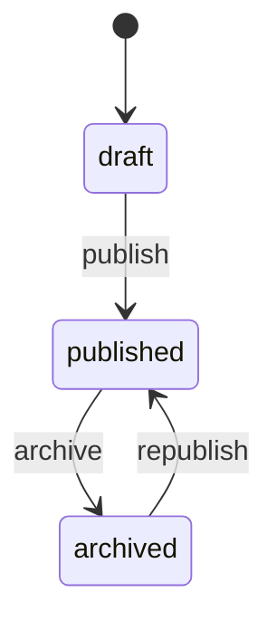

# Project Glossary

## Overview

This document defines the ubiquitous language for AstroSocial — the terms used consistently across the PRD, functional design, architecture, repository structure, and development guidelines.

**Updated**: 2026-06-13

## Domain Terms

### Post

**Definition**: A unit of published content authored by a user; may be a short note, a long-form article, or a media-rich piece.

**Description**: Stored with a Markdown body, optional title, cover image, excerpt, status, and a stable canonical path. A post can also be a quote post (referencing another post).

**Related Terms**: Cover Image, Slug, Canonical Path, Quote Post, Draft/Published/Archived.

**Usage Examples**:
- "Publish the post to its unique URL."
- "List views never load the post body."

**English Notation**: Post

### Quote Post

**Definition**: A normal post that embeds another post along with the author's own commentary.

**Description**: Implemented via `posts.quote_post_id`. If the original post is deleted, the quote post remains and the embedded card renders "This post has been deleted." Distinct from a Repost, which adds no commentary.

**Related Terms**: Repost, Post.

### Repost

**Definition**: Resharing another user's post to one's followers without added commentary.

**Description**: Appears in the following timeline labeled "X reposted" above the original card. Unique per (post, user); deleted posts cannot be reposted.

**Related Terms**: Quote Post, Following Timeline, Timeline Item.

### Cover Image

**Definition**: The headline image associated with a post, used in the discovery grid and as the OGP image.

**Description**: A media item linked via `posts.cover_media_id` (and a `post_media` row with `usage_type = 'cover'`). Featured images from WordPress migrate into cover images.

**Related Terms**: Media, Post, OGP.

### Media

**Definition**: An uploaded file (image or video) owned by a user, addressable by its own public URL.

**Description**: Validated by MIME/extension/size, stored under a randomized name with an optional thumbnail. Visibility is public, unlisted, or private.

**Related Terms**: Media Library, Thumbnail, Public ID, Visibility.

### Following Timeline

**Definition**: A feed of content from users the current user follows.

**Description**: Returns Timeline Items (normal post, repost, quote post) rather than raw posts.

**Related Terms**: Timeline Item, Follow, Repost, Quote Post.

### Timeline Item

**Definition**: A typed entry in the following timeline (`type`: normal post, repost, or quote post) carrying the acting user and the referenced post.

**Related Terms**: Following Timeline.

### Trend

**Definition**: A ranking of popular posts, tags, or users over a time window (24h / 7d / 30d).

**Description**: Computed from a weighted engagement score, persisted periodically as trend snapshots. See "Calculations and Algorithms".

**Related Terms**: Trend Score, Trend Snapshot.

### WordPress Migration / Import

**Definition**: The process of importing existing WordPress content (users, posts, pages, media, comments, categories, tags) into AstroSocial via a WordPress Export XML file.

**Description**: Runs as a tracked import job with logs, progress, cancel/retry, and idempotency (re-importing the same file creates no duplicates).

**Related Terms**: Import Job, Import Mapping, Import Log, HTML to Markdown, Gutenberg Block, Shortcode.

### PIN Login

**Definition**: Passwordless authentication via a 6-digit code emailed to the user.

**Description**: PIN is hashed, expires after 10 minutes, is rate-limited, and has a failed-attempt cap. First successful login auto-creates the user.

**Related Terms**: Session, Login PIN (entity).

## Technical Terms

### Next.js (App Router)

**Definition**: React framework providing server components, pages, and `/api` route handlers.

**Official Site**: https://nextjs.org

**Usage in This Project**: The single application runtime — UI (pages/RSC) and the HTTP/API layer (`app/api/**`).

**Version**: Latest stable.

**Related Documents**: `docs/architecture.md`, `docs/functional-design.md`.

### SQLite

**Definition**: An embedded, single-file relational database.

**Official Site**: https://www.sqlite.org

**Usage in This Project**: Primary datastore (WAL mode, `busy_timeout`), with FTS5 for full-text search. Accessed only through repository classes.

**Version**: Bundled with `better-sqlite3`.

### better-sqlite3

**Definition**: A synchronous Node.js SQLite driver.

**Official Site**: https://github.com/WiseLibs/better-sqlite3

**Usage in This Project**: The DB driver behind `lib/db/connection.ts` and all repositories; supports parameterized prepared statements.

### Tiptap / Milkdown

**Definition**: Extensible rich-text editors supporting WYSIWYG and Markdown.

**Official Site**: https://tiptap.dev / https://milkdown.dev

**Usage in This Project**: The post editor with dual Markdown/WYSIWYG modes, a formatting toolbar, and inline media insertion.

### sharp

**Definition**: High-performance Node.js image processing library.

**Official Site**: https://sharp.pixelplumbing.com

**Usage in This Project**: Re-encoding uploaded images and generating thumbnails safely.

### Playwright

**Definition**: A cross-browser end-to-end testing framework.

**Official Site**: https://playwright.dev

**Usage in This Project**: E2E test suite run in a Dockerized environment with a mock email server.

## Abbreviations and Acronyms

### MVP
**Full Name**: Minimum Viable Product.
**Meaning**: The smallest releasable version delivering core value.
**Usage in This Project**: Scopes Phase 1–4 features; trends and WordPress REST import are beyond core MVP.

### PWA
**Full Name**: Progressive Web App.
**Meaning**: A web app installable like a native app, with offline support.
**Usage in This Project**: Manifest, service worker, app icons, offline fallback, static asset caching.

### DM
**Full Name**: Direct Message.
**Meaning**: A private 1-to-1 text conversation between users.
**Usage in This Project**: `dm_conversations`, `dm_conversation_members`, `dm_messages`; governed by a user's DM policy.

### OGP
**Full Name**: Open Graph Protocol.
**Meaning**: Metadata for link previews on social platforms.
**Usage in This Project**: Cover images double as OGP images for shared posts.

### FTS5
**Full Name**: Full-Text Search version 5 (SQLite).
**Meaning**: SQLite's full-text search extension.
**Usage in This Project**: Powers search over post title/body, username, display name, and tags.

### XXE / SSRF
**Full Name**: XML External Entity / Server-Side Request Forgery.
**Meaning**: Two attack classes relevant to XML parsing and URL fetching.
**Usage in This Project**: Mitigated during WordPress import (external entities disabled; download URLs validated; localhost/private IPs blocked).

## Architecture Terms

### Layered Architecture

**Definition**: Separation into UI → API → Service → Data → Infrastructure layers with one-directional dependencies.

**Application in This Project**: Pages/components call services (or API handlers), services call repositories, repositories own SQL. Lower layers never depend on higher ones.

**Related Components**: `app/`, `lib/services/`, `lib/db/repositories/`.

```
UI → API → Service → Data → Infrastructure
```

### Repository Pattern (No ORM)

**Definition**: A class per table encapsulating all data access via parameterized raw SQL.

**Application in This Project**: Mandatory — no ORM is permitted; no SQL exists outside `lib/db/repositories/`.

**Related Components**: `UserRepository`, `PostRepository`, `MediaRepository`, etc.

### Storage Provider

**Definition**: An interface abstracting file storage.

**Application in This Project**: `localStorageProvider` writes to the uploads volume; the interface allows adding S3-compatible storage later without touching services.

### Migration Runner

**Definition**: Startup component that applies pending SQL migrations in order and fails startup on error.

**Application in This Project**: `lib/db/migrate.ts` reads `migrations/NNNN_*.sql`, records applied files in the `migrations` table.

## Statuses and States

### Post Status

| Status | Meaning | Transition Condition | Next State |
|----------|------|---------|---------|
| draft | Created, not public | Author publishes | published |
| published | Public, has `published_at` and canonical path | Author archives | archived |
| archived | Hidden from feeds, retained | Author republishes (optional) | published |



### Import Job Status

| Status | Meaning | Transition Condition | Next State |
|----------|------|---------|---------|
| pending | Job created, not started | Start processing | running |
| running | Items being processed | All processed / error / user cancels | completed / failed / cancelled |
| completed | Finished with counts | — | — |
| failed | Aborted with errors | Retry | running |
| cancelled | Stopped by user | — | — |

### Media Visibility

| State | Meaning |
|-------|---------|
| public | Visible to anyone (default) |
| unlisted | Accessible by direct URL only |
| private | Owner only |

### DM Policy

| State | Meaning |
|-------|---------|
| everyone | Anyone can DM the user |
| following | Only users the recipient follows |
| mutual | Only mutual follows |
| nobody | DMs disabled |

## Data Model Terms

### users

**Definition**: A registered account.

**Key Fields**: `email` (unique), `username` (unique, used in URLs), `display_name`, `dm_policy`.

**Related Entities**: posts, media, sessions, follows.

**Constraints**: unique `email`, unique `username`.

### posts

**Definition**: Authored content.

**Key Fields**: `public_id`, `slug`, `canonical_path`, `markdown_body`, `cover_media_id`, `quote_post_id`, `status`.

**Related Entities**: users, media (cover), post_media, comments, likes, reactions, reposts, bookmarks, post_tags.

**Constraints**: unique `public_id`, unique `canonical_path`, unique `(user_id, slug)`.

### media

**Definition**: An uploaded file.

**Key Fields**: `public_id`, `canonical_path`, `file_name` (randomized), `mime_type`, `visibility`.

**Constraints**: unique `public_id`, unique `canonical_path`.

### import_mappings

**Definition**: Source-to-target mapping that guarantees idempotent imports.

**Key Fields**: `source_type`, `source_id`, `target_type`, `target_id`.

**Constraints**: `UNIQUE(import_job_id, source_type, source_id)` — prevents duplicate imports.

## Public ID and URL Terms

### Public ID

**Definition**: A stable, opaque identifier exposed in URLs (e.g. `p_8f3a9c21` for posts, `m_7a2c91df` for media).

**Description**: Distinct from the internal primary key `id`; safe to share publicly.

### Slug

**Definition**: A human-readable, URL-safe post identifier unique per user.

**Description**: Lowercase, alphanumeric + hyphens, ≤ 80 chars, generated from the title with a numeric/public-id suffix on collision.

### Canonical Path

**Definition**: The authoritative public path for a post or media item.

**Description**: Posts: `/@username/posts/slug` (or `/posts/publicId` when untitled). Media: `/@username/media/mediaPublicId`. Unique per resource type.

## Errors and Exceptions

### ValidationError
**Class Name**: `ValidationError`
**Trigger Condition**: Invalid input (bad field, unsupported file, malformed slug).
**Resolution**: Correct the input; surfaced as HTTP 400 with field info.
**Example**:
```typescript
throw new ValidationError('Title is too long', 'title');
```

### NotFoundError
**Class Name**: `NotFoundError`
**Trigger Condition**: Requested post/media/user does not exist.
**Resolution**: HTTP 404 / friendly not-found page.

### PermissionError
**Class Name**: `PermissionError`
**Trigger Condition**: Acting on a resource the user doesn't own / isn't allowed to.
**Resolution**: HTTP 403.

### RateLimitError
**Class Name**: `RateLimitError`
**Trigger Condition**: Too many PIN requests/verifications or uploads.
**Resolution**: HTTP 429; retry later.

## Calculations and Algorithms

### Trend Score

**Definition**: Weighted engagement score used to rank trends within a time window.

**Formula**:
```
trend_score =
    likes_count     * 1
  + reactions_count * 1
  + comments_count  * 2
  + reposts_count   * 3
  + quote_posts_count * 3
  + bookmarks_count * 2
```
(optionally adjusted by age decay)

**Implementation Location**: `lib/services/TrendService.ts` (score) + `lib/db/repositories/TrendRepository.ts` (snapshots).

**Example**:
```
Input:  likes=10, reactions=5, comments=3, reposts=2, quotes=1, bookmarks=4
Output: 10 + 5 + 6 + 6 + 3 + 8 = 38
```

### Slug Generation

**Definition**: Produces a unique URL-safe slug per user from a title.

**Implementation Location**: `lib/urls/slug.ts`.

**Example**:
```
Input:  "AstroSocial Design Notes" (no collision)
Output: "openmeow-design-notes"

Input:  "AstroSocial Design" (collides with existing)
Output: "openmeow-design-2"
```
