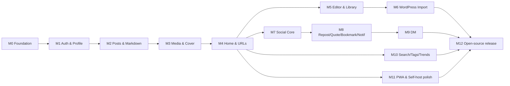

# AstroSocial Implementation Plan

This plan sequences the build of AstroSocial into milestones with concrete deliverables, exit criteria, and dependencies. It is derived from the development phases in `docs/product-requirements.md` and the structure in `docs/architecture.md` / `docs/repository-structure.md`.

Each milestone is sized to be independently shippable and verifiable (unit tests + relevant E2E pass). Use `/add-feature` per feature and `.steering/` working docs per task.

## Guiding principles

- **Foundation first**: DB connection, migrations, and the repository pattern underpin everything; build them before any feature.
- **Vertical slices**: each milestone delivers a usable end-to-end capability, not just a layer.
- **Test as you go**: unit tests for every `lib/` module; an E2E spec accompanies each user-facing milestone (per the updated `add-feature` workflow).
- **Security is not a phase**: parameterized SQL, sanitization, and upload/import hardening are part of every relevant task, not deferred.

## Dependency overview

---

## Milestone 0 — Project foundation  ✅ Implemented (2026-06-13)
**Goal**: A running app with SQLite, migrations, and the repository pattern in place.

> **Status:** Done. Delivered the SQLite connection (WAL/busy_timeout/foreign_keys),
> migration runner (ordered, idempotent, fail-fast), migrations 0001–0008, URL
> utilities, scrypt hashing, and config + test-mode. The web layer is currently a
> thin `node:http` adapter run via `tsx` (a documented simplification; see
> `docs/architecture.md`) rather than Next.js.

**Deliverables**:
- Next.js (App Router) + TypeScript scaffold, ESLint/Prettier, `npm test`/`lint`/`typecheck` scripts.
- `lib/db/connection.ts` (WAL, `busy_timeout`, FTS5 enabled).
- `lib/db/migrate.ts` MigrationRunner (ordered apply, `migrations` table, fail-fast on startup).
- First migrations: `0001_create_users.sql` … `0007_create_import_tables.sql` (full schema from `docs/architecture.md`).
- Base repository conventions + one reference repository with unit tests.
- `lib/urls/` (`publicId`, `slug`, `canonicalPath`) with full unit tests.
- Docker: `Dockerfile`, `docker-compose.yml`, entrypoint (validate env → make dirs → migrate → start).

**Exit criteria**: `docker compose up` starts the app, applies all migrations, and a corrupt/failing migration aborts startup. URL/slug unit tests green.

**Maps to**: PRD §"PWA and self-hosting", Phase 1 setup items.

---

## Milestone 1 — Authentication & user profile (P0)  ✅ Implemented (2026-06-13)
**Goal**: Passwordless email-PIN login and editable public profiles.

> **Status:** Done. Delivered AuthService (PIN request/verify, rate limiting, PIN
> expiry, failed-attempt lockout, auto-create user, sessions) and ProfileService
> (public profile + editing), with `User`/`LoginPin`/`Session` repositories, the
> auth + profile HTTP API, minimal login/profile/settings pages, a deterministic
> test mode (PIN `000000`), and a Playwright E2E suite. Avatar/cover image upload
> is deferred to M3.

**Deliverables**:
- `lib/auth/pin.ts`, `lib/auth/session.ts`; `AuthService`; `LoginPinRepository`, `SessionRepository`, `UserRepository`.
- API: `/api/auth/request-pin`, `/verify-pin`, `/logout`, `/me`.
- Email provider abstraction (SMTP) with a mock for tests.
- Profile page `/@username` + profile settings (edit display name, bio, avatar, cover, website, location).
- Rate limiting + failed-attempt caps; hashed PINs/tokens; HttpOnly+Secure+SameSite cookies.

**Exit criteria**: E2E `auth/login.spec.ts` (email → PIN via mock email → login → logout) passes; profile edits persist.

**Maps to**: PRD Auth, User Profile.

---

## Milestone 2 — Posts & Markdown rendering (P0)
**Goal**: Create, edit, publish, archive, delete posts with Markdown rendering and unique URLs.

**Deliverables**:
- `PostService`, `PostRepository`; `lib/markdown/render.ts` + `sanitize.ts`.
- API: posts CRUD + `/publish`, `/archive`.
- Slug/publicId/canonicalPath generation wired into create/publish; collision handling.
- Post detail page with long-form styling (constrained width, line height, headings, code blocks, optional TOC).
- Status state machine (draft/published/archived).

**Exit criteria**: Create→publish opens `/@username/posts/slug`; sanitization unit tests (XSS payloads stripped) green; E2E draft→publish passes.

**Maps to**: PRD Posts, Unique URLs.

---

## Milestone 3 — Media upload & cover images (P0)
**Goal**: Upload images, generate thumbnails, attach cover images, serve media by URL.

**Deliverables**:
- `MediaService`, `MediaRepository`, `PostMediaRepository`; `lib/storage/localStorageProvider.ts`; `sharp` integration.
- API: `/api/media/upload`, list, get, delete; file serving `/media/:publicId/original|thumbnail` (respects visibility).
- Cover image upload/select/replace/remove; thumbnails + alt text.
- Upload hardening: MIME+extension+size validation, randomized names, path-traversal prevention, image re-encode.

**Exit criteria**: Image upload + thumbnail + cover assignment works; visibility enforced on serve; upload-rejection unit tests green.

**Maps to**: PRD Media Upload, Cover Images.

---

## Milestone 4 — Home grid & discovery shell (P0)
**Goal**: The cover-image home grid and core navigation; cursor pagination.

**Deliverables**:
- Home page grid (desktop 3–4 col + nav/sidebar; mobile single-column + bottom nav).
- Post cards (cover, title, author, date, counts, excerpt, reading time) using thumbnails and lazy loading.
- Cursor-based feed API selecting card columns only.
- Layout components (`components/layout/`).

**Exit criteria**: Home renders a paginated grid; list queries verified not to load `markdown_body`; mobile/desktop layouts verified.

**Maps to**: PRD Home Page; Performance NFRs.

---

## Milestone 5 — Full editor & media library (P1)
**Goal**: Dual Markdown/WYSIWYG editor with inline media insertion, drafts, auto-save; video upload.

**Deliverables**:
- Tiptap/Milkdown editor (`components/editor/`): toolbar, preview, undo/redo, Markdown↔WYSIWYG.
- Media library + picker; insert at cursor; alt text, caption, display size.
- Auto-save + drafts list.
- Video upload (MP4/WebM), inline video, optional ffmpeg poster/thumbnail.

**Exit criteria**: E2E post creation with cover + image + video + inline insertion + preview + draft + publish passes.

**Maps to**: PRD Editor, Media Upload (video), Drafts.

---

## Milestone 6 — WordPress migration (P0 for XML method)
**Goal**: Import WordPress Export XML end-to-end, idempotently.

**Deliverables**:
- `lib/wordpress/`: `parseXml` (XXE off), `convertPost` (HTML→Markdown, Gutenberg strip, shortcodes), `importMedia` (SSRF-safe downloader), `importUsers`, `importComments`.
- `WordPressImportService`, `ImportRepository`; jobs/logs/mappings tables.
- API: preview, start, job status, logs, cancel, retry.
- Import UI: start → preview → progress → complete; status mapping; featured→cover; inline URL replacement; guest comments.

**Exit criteria**: E2E `import/wordpress-import.spec.ts` imports a fixture export, verifies posts/media/comments/users, and re-import creates no duplicates. Import-security unit tests (XXE, SSRF, size limits) green.

**Maps to**: PRD WordPress Migration; depends on M3 (media) and M2 (posts).

---

## Milestone 7 — Social core: comments, likes, reactions, follow (P1)
**Goal**: Lightweight social interaction and the following timeline.

**Deliverables**:
- `CommentService`/`ReactionService`/`FollowService` (+ repositories); single-level comments; likes (once per post); emoji reactions (default set, once per emoji); follow/unfollow + counts/lists.
- `TimelineService` returning Timeline Items; following timeline page.
- API for comments, likes, reactions, follows.

**Exit criteria**: E2E `social/interactions.spec.ts` (comment, like, react, follow) passes; uniqueness constraints enforced.

**Maps to**: PRD Comments, Likes, Reactions, Follow.

---

## Milestone 8 — Repost, quote, bookmarks, notifications (P1)
**Goal**: Resharing and the notification system.

**Deliverables**:
- `RepostRepository`, quote-post creation (`quote_post_id`), deleted-original placeholder; bookmarks + list.
- `NotificationService`/`NotificationRepository`; notifications for comment/like/reaction/follow/repost/quote/dm; list, unread count, mark-(all-)read.
- Timeline rendering of reposts ("X reposted") and quote cards.

**Exit criteria**: Repost/quote/bookmark flows + notification generation covered by E2E; deleted-original quote renders placeholder.

**Maps to**: PRD Reposts, Quote Posts, Bookmarks, Notifications.

---

## Milestone 9 — Direct messages (P1)
**Goal**: 1-to-1 text DMs with privacy controls.

**Deliverables**:
- `DMService`, `DMRepository`; conversations/members/messages; unread count, read status, delete own message.
- DM privacy policy enforcement (everyone/following/mutual/nobody).
- DM inbox + conversation UI; DM notifications.

**Exit criteria**: E2E `dm/conversation.spec.ts` (start, send, read, unread count) passes; policy enforced.

**Maps to**: PRD Direct Messages.

---

## Milestone 10 — Search, tags & trends (P1/P2)
**Goal**: Discovery via full-text search, taxonomies, and trends.

**Deliverables**:
- FTS5 search over post title/body, username, display name, tags; search page.
- Tags & categories (`TagRepository`, `post_tags`); tag/category pages; tag-based search.
- Trends: `TrendService` (score), `TrendRepository` (snapshots), periodic snapshot job; trends page/sidebar (24h/7d/30d).

**Exit criteria**: Search returns relevant results; tag pages list posts; trend snapshots compute and rank correctly (unit-tested score).

**Maps to**: PRD Search, Tags/Categories, Trends.

---

## Milestone 11 — PWA & self-host polish (P1)
**Goal**: Installable, offline-capable, smooth self-hosting.

**Deliverables**:
- `manifest.json`, service worker, app icons, offline fallback page, static asset caching.
- OGP tags (cover image), responsive verification across breakpoints.
- Volume persistence verification (DB, uploads, thumbnails, logs); backup/restore docs.

**Exit criteria**: PWA install + offline fallback verified by E2E; data survives container restart.

**Maps to**: PRD PWA Requirements, Docker Compose, Reliability NFRs.

---

## Milestone 12 — Open-source release (P1)
**Goal**: A welcoming, contributable repository.

**Deliverables**:
- README, sample/seed data, LICENSE (MIT or Apache-2.0), CONTRIBUTING, SECURITY policy.
- GitHub Actions CI (lint, typecheck, unit, Playwright via `docker-compose.e2e.yml`).
- Full E2E suite green; basic admin settings and moderation; RSS (optional).

**Exit criteria**: CI green on a clean checkout; a new contributor can run the app and tests from the README alone.

**Maps to**: PRD Phase 5; MVP Success Criteria #20.

---

## Cross-cutting tracks (run continuously)

- **Testing**: maintain ≥ 80% unit coverage on `lib/`; 100% on sanitize / SQL allowlists / PIN-session; grow the Playwright suite per milestone.
- **Security**: review every PR against the security checklist in `docs/development-guidelines.md`.
- **Docs**: update persistent docs in `docs/` whenever a milestone changes fundamental design; record per-task retrospectives in `.steering/`.

## Suggested sequencing

1. **Critical path to a usable publishing MVP**: M0 → M1 → M2 → M3 → M4 (this alone delivers PRD Success Criteria #1–9).
2. **Differentiator**: M6 (WordPress import) and M5 (full editor) next.
3. **Social platform**: M7 → M8 → M9.
4. **Discovery & polish**: M10, M11, then M12 for release.

M5/M6 and the social track (M7+) can proceed in parallel once M4 is done, since they depend on different subsystems.
